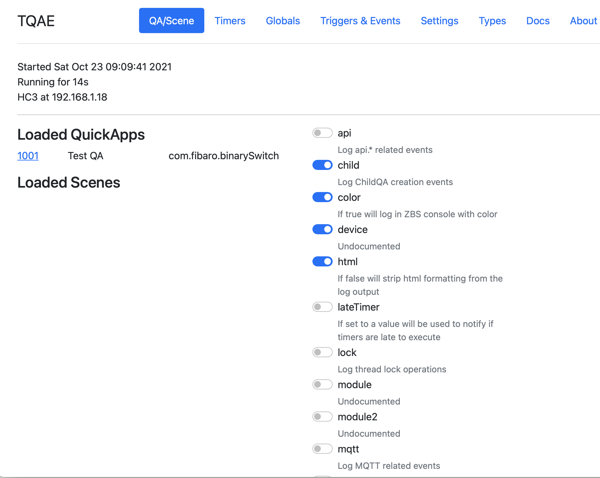
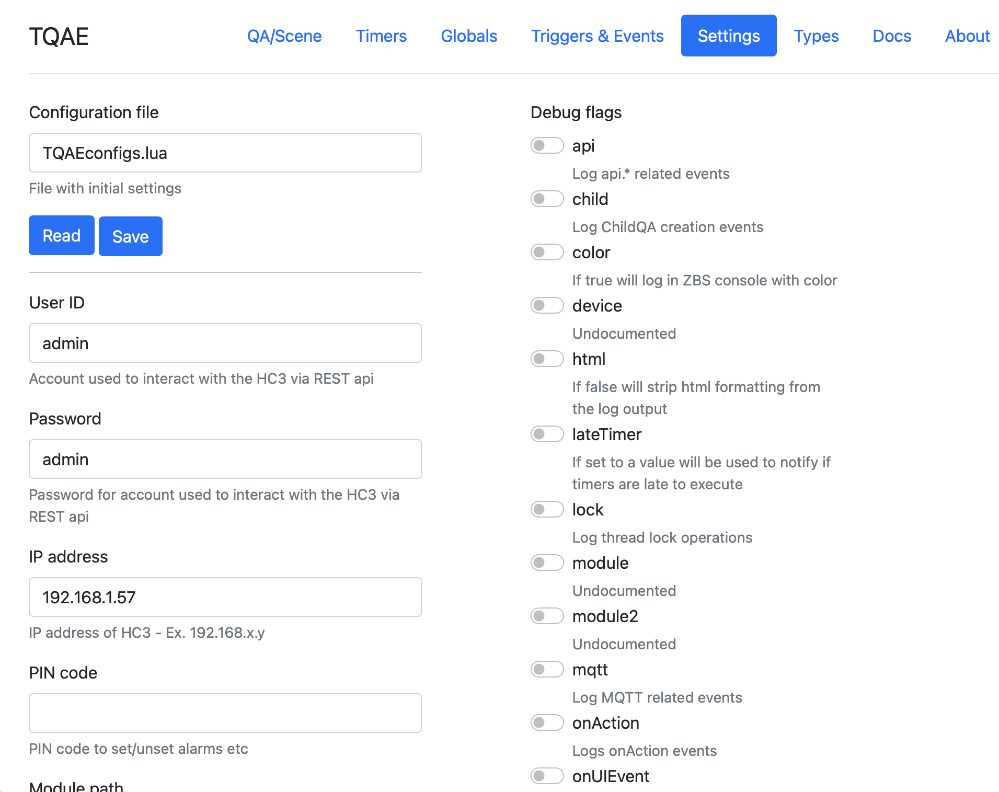

# TQAE

Forum documentation here <https://forum.fibaro.com/topic/55045-tiny-quickapp-emulator-tqae/>

The source for the emulator is aviable at the Fibaro forum link or directly from this GitHub

Tiny QuickApp Emulator (TQAE) started out as a simple modular QuickApp emulator but have evolved into a pretty good development environment.
(Great intro to TQAE [\<here>](https://docs.joepverhaeg.nl/hc3-tqae/) from @Joep - thanks!)

```bash
/TQAE.lua v0.57                    -- Main emulator, loads other modules
 
/modules/sync.lua                  -- timers with fake asynchronous IO
/modules/async.lua                 -- timers with asynchronous IO based on copas
/modules/copas.lua                 -- copas.* functions
/modules/net.lua                   -- net.* functions
/modules/api.lua                   -- api.* and web api
/modules/json.lua                  -- json library
/modules/fibaro.lua                -- fibaro.* functions
/modules/class.lua                 -- class function
/modules/files.lua                 -- support for loading files, *.lua and *.fqa files
/modules/QuickApp.lua              -- QuickApp classes
/modules/devices.json              -- device templates
/modules/webserver.lua             -- web server for remote calls (ex. from proxy)
/modules/proxy.lua                 -- creates QA proxy on the HC3 for funnelling back onAction and UIevents
/modules/ui.lua                    -- Local Web UI for QA
/modules/time.lua                  -- Time manipulation - changing start time...
/modules/refreshStates.lua         -- /refreshStates support
/modules/Scene.lua                 -- Initial support
/modules/offline.lua               -- Support for local shadowing resources. Currently /globalVariables
/modules/stdQA.lua                 -- Standard (simulated) devices
 
/web/main.html                     -- Web - Main emulator page
/web/qa.html                       -- Web - QuickApp info
/web/ui.html                       -- Web - QuickApp UI
/web/timers.html                   -- Web - list of active timers
/web/settings.html                 -- Web - editor for configuration file
 
examples/MyQuickApp.lua            -- Simple QuickApp
examples/Hue.lua                   -- Hue QuickApp with QuickAppChildren
examples/Scheduler.lua             -- Simple minute based scheduler
examples/Ping.lua                  -- Ping QuickApp that loads Pong QuickApp and exchanges fibaro.calls...
examples/Pong.lua
examples/TestScene.lua             -- Test scene   
examples/TestSceneCron.lua         -- Test scene  with Date condition
examples/Backup.lua                -- Non-QA code that backs up QuickApps from the HC3 to the local filesystem as *.fqa files
examples/SamsunWebSocket.lua       -- WebSocket example controlling my Samsung TV
examples/TestTCPSocket.lua         -- TCPSocket example with emulated responses
 
setup/TQAEplugin.lua               -- ZBS plugin to give editor help and fibaro command completion.
 
TQAE.gz                            -- Every file in one archive
```

Installation
First time download the archive, [TQAE.tar.gz](https://github.com/jangabrielsson/TQAE/archive/master.tar.gz) and unpack it in a suitable directory on your PC/Mac/Linux.
On Linux:

```bash
>tar xvf TQAE-main.tar
```

On PC/Mac use suitable archive program to unpack the archive.

```bash
../TQAE/TQAE.lua
../TQAE/TQAE_QA.lua
../TQAE/modules/*
../TQAE/web/*
../TQAE/examples/*
../TQAE/...
```

Alternatively, and preferred, clone the GitHub repository

```bash
>git clone https://github.com/jangabrielsson/TQAE
```

The setup procedure would be

```bash
EMB-31KYQ6LT:~ erajgab$ mkdir development                     # Create new directory to develop in
EMB-31KYQ6LT:~ erajgab$ cd development/
EMB-31KYQ6LT:development erajgab$ git clone https://github.com/jangabrielsson/TQAE # Clone repository
Cloning into 'TQAE'...
remote: Enumerating objects: 1790, done.
remote: Counting objects: 100% (192/192), done.
remote: Compressing objects: 100% (135/135), done.
remote: Total 1790 (delta 118), reused 122 (delta 57), pack-reused 1598
Receiving objects: 100% (1790/1790), 1.75 MiB | 7.28 MiB/s, done.
Resolving deltas: 100% (1198/1198), done.
EMB-31KYQ6LT:development erajgab$ ls                          # We got the code...
TQAE
EMB-31KYQ6LT:development erajgab$ cd TQAE/
EMB-31KYQ6LT:TQAE erajgab$ ls
LICENSE     TQAE.tar.gz   examples    modules
README.md   TQAE_QA.lua   jgabs_QAs   setup
TQAE.lua    TQAEconfigs.example       lib     web
EMB-31KYQ6LT:TQAE erajgab$ mkdir test                          # Create 2 directories to do your own development in
EMB-31KYQ6LT:TQAE erajgab$ mkdir dev
```

So both directories dev and test are in .gitignore, so you can update the TQAE code with the command (while standing in the TQAE directory)

```bash
EMB-31KYQ6LT:TQAE erajgab$ git fetch
```

This will update the TQAE code (it's usually updated quite often) but will leave your test and dev directories untouched.
You can also link dev to some other directory where you do your development.
I will do my best to keep the repository clean. This way it's easy to keep up with updates of the code.

Download ZeroBrane studio <link>
Open ZBS and open the TQAE_QA.lua file
Set project directory in ZBS to the current file, TQAE_QA.lua (Project->Project Directory->Set From Current File)

Also set Lua interpreter to Lua 5.3 (Project->Lua Interpreter->Lua 5.3)
Now, run TQAE_QA.lua (F5 in ZBS).
The output will look something like:

```bash
---------------- Tiny QuickAppEmulator (TQAE) v0.30 -------------
[11.10.2021] [08:33:23] |  SYS|: No connection to HC3
[11.10.2021] [08:33:23] |  SYS|: Created WebAPI at 192.168.1.18:8976
[11.10.2021] [08:33:23] |  SYS|: sunrise 07:43, sunset 19:50
```

Note first that there is no connection to the HC3 - we are missing user,  password, and IP for the HC3.
Secondly, note the WebAPI address. 192.168.1.18 is my machine, your IP address may be different. The port is 8976.

While TQAE_QA.lua is running open <http://192.168.1.18:8976/web/main> in your browser. (the Web UI only works while the emulator is running)



Goto [Settings] in the web page menu (upper right).




Fill in User ID, Password, and IP address for the HC3. Click "Save"
Hopefully there is now a TQAEconfigs.lua file with the HC3 credentials that the emulator can use.
Go back to ZBS and stop the program (Shift-F5) and run it again:

```bash
---------------- Tiny QuickAppEmulator (TQAE) v0.30 -------------
[11.10.2021] [09:13:43] |  SYS|: Using config file TQAEconfigs.lua
[11.10.2021] [09:13:43] |  SYS|: Created WebAPI at 192.168.1.18:8976
[11.10.2021] [09:13:43] |  SYS|: sunrise 07:14, sunset 17:52
```

It loads the config file and doesn't complain that there is no connection to the HC3 anymore.

If you run ZBS I strongly encourage you to download the copy the TQAE/setup/TQAEplugin.lua file to your home directory ~/.zbstudio/packages/TQAEplugin.lua
Also create directory ~/.zbstudio/tqae and move the files  TQAE/setup/codeTemplates.lua and  TQAE/setup/fileDownloads.lua to that directory.
It will give you tooltips for the fibaro lua functions and some shortcuts to download updates to TQAE.
Restart ZBS after installing the files.

Great we are up and running!

Supported functions (v0.33)

```lua
fibaro.debug(tag,str) 
fibaro.warning(tag,str) 
fibaro.trace(tag,str) 
fibaro.error(tag,str)

fibaro.call(deviceID, actionName, ...) 
fibaro.getType(deviceID) 
fibaro.getValue(deviceID, propertyName)
fibaro.getName(deviceID) 
fibaro.get(deviceID,propertyName) 
fibaro.getGlobalVariable(varName)
fibaro.setGlobalVariable(varName ,value) 
fibaro.getRoomName(roomID)
fibaro.getRoomID(deviceID)
fibaro.getRoomNameByDeviceID(deviceID) 
fibaro.getSectionID(deviceID)
fibaro.getIds(devices)
fibaro.getAllDeviceIds()
fibaro.getDevicesID(filter)
fibaro.scene(action, sceneIDs)
fibaro.profile(profile_id, action)
fibaro.callGroupAction(action,args)
fibaro.alert(alert_type, user_ids, notification_content) 
fibaro.alarm(partition_id, action)
fibaro.setTimeout(ms, func)
fibaro.clearTimeout(ref)
fibaro.setInterval(ms, func) 
fibaro.clearInterval(ref)
fibaro.emitCustomEvent(name)
fibaro.wakeUpDeadDevice(deviceID)
fibaro.sleep(ms)

net.HTTPClient()
net.TCPSocket()
net.UDPSocket()
net.WebSocketClient()
net.WebSocketClientTLS()
mqtt.Client.connect(uri, options)
<mqttclient>:addEventListener(message,handler)
<mqttclient>:subscribe(topic, options) 
<mqttclient>:unsubscribe(topics, options) 
<mqttclient>:publish(topic, payload, options) 
<mqttclient>::disconnect(options) 

api.get(call) 
api.put(call <, data>) 
api.post(call <, data>)
api.delete(call <, data>)

setTimeout(func, ms)
clearTimeout(ref)
setInterval(func, ms)
clearInterval(ref)
json.encode(expr)
json.decode(string)
  
plugin.mainDeviceId
plugin.deleteDevice(deviceId)
plugin.restart(deviceId)
plugin.getProperty(id,prop)
plugin.getChildDevices(id)
plugin.createChildDevice(prop)

class QuickAppBase
class QuickApp
class QuickAppChild

class <name>
property(get,set)
  
QuickApp:onInit() -- called at startup if defined
QuickApp - self:setVariable(name,value) 
QuickApp - self:getVariable(name)
QuickApp - self:debug(...)
QuickApp - self:trace(...)
QuickApp - self:warning(...)
QuickApp - self:error(...)
QuickApp - self:updateView(elm,type,value)
QuickApp - self:updateProperty(name,value)
QuickApp - self:createChildDevice(props,device)
QuickApp - self:initChildDevices(table)
```

The idea and reason that I implement an offline emulator for the HC3 is that it is generally speaking a pain to debug a moderately complex QuickApp on the HC3. You are left to using debug statements and it slow you down as you can not set breakpoint and step through the code to understand what logic it is following.

With an offline emulator running on a PC/Mac you can use a modern IDE like ZeroBrane or VisualStudio to develop your QA. You can quickly put together 99.9% of your QA and the speed/productivity tripples.
When it works in the emulator you can move the code to the HC3 and it will work.
No need to develop on the HC3 and accidentally crash the whole box and make your family upset.

Here is a video showing a typical workflow.

[video](https://youtu.be/e76sVOBEWtw)
<iframe width="560" height="315"
src="https://youtu.be/e76sVOBEWtw"
frameborder="0"
allow="accelerometer; autoplay; encrypted-media; gyroscope; picture-in-picture"
allowfullscreen></iframe>

(Note that the Web UI now has a button "Upload" that uploads the QuickApp when it's ready to the HC3)

Writing HC3 (HC2) emulators seems to be a hobby for me - but what better thing to do on a vacation? :-)
So far I have
HC2 Scene emulator - quite ok and feature complete, not actively developed anymore but still works well (not much has happened to the HC2 scene framework lately)
HC3 emulator (fibaroapiHC3.lua) - gazillion of features, 9.5k lines - haven't come across any QA it can't run. Also some basic Scene support
HC3 micro emulator - ~70 lines of Lua that can run QAs in parallel but have a very limited function support. Developed to prove that we could enhance the call model of QAs without much work

Well, the micro emulator got my interest and I have evolved it to a more full featured emulator - Tiny QuickApp Emulator (TQAE).
Runs multiple QAs in parallel - can test fibaro.calls between them
Supports net.HTTPClient, setTimeout, clearTimeout, setInterval, clearInterval, json.*, class, property
Supports QuickApp methods - self:setVariable, self.getVariable, self:updateProperty, self:updateView
Supports fibaro.* functions
Supports QuickAppChild devices
Supports simple web UI to test QuickApp buttons/sliders
Supports proxy QA on the HC3 to make to emulated QA interact with QAs running on the HC3 - Real HC3 QAs can call the QA you are running in the emulator. (and you get a real UI too)
The main idea is that the emulator could be used as a light weight playground for testing out QAs

The main logic is still under 1000 lines with current modules but stuff like json support and the whole fibaro.* sdk requires quite some code so it tends to swell - in any case it's modular.
Dependencies on luasocket. (I recommend the free ZeroBrane Studio as it comes with the necessary libraries and is a specialised development environment for Lua)

```lua
local http    = require("socket.http")
local socket  = require("socket")
local ltn12   = require("ltn12")
```

It has an easy structure (I think).
TQAE.thumb.png.8cb5f726ba525bd31f684b422496aa2e.png

There are very few differences between TQAE and fibaroapiHC3.lua so I mainly work with TQAE these days.

Advantages  compared to fibaroapiHC3.lua.
Easier to debug as code is not as asynchronous as it is in the fibaroapiHC3 scheduler (possibility to use a sync scheduler).
Uses a vanilla fibaro.\* implementation only leveraging api.\* and \_\_fibaro_\* calls, so it should be easy to upgrade if we get new fibaro.* calls.
Module structure makes it easy to add new libraries etc. It's modular.

Include it in your QA code

```Lua
_=loadfile and loadfile("TQAE.lua"){ user="admin", pwd="admin", host="192.168.1.57" }

--%%name='Test'
--%%id=99
--%%quickVars={x=88,y=99}

function QuickApp:onInit()
  self:debug(self.name,self.id)
  self:debug("y=",self:getVariable("y"))
  local n = 5
  setInterval(function() 
      n=n-1
      if n <= 0 then os.exit() end
      self:debug("PING") 
      end,1000)
end
```

The loadfile at the top loads in the emulator and run your QA.
The { ... } table after loadfile("TQAE.lua") is a table with configuration options to the emulator. The emulator needs ip, user and password to access the HC3.
If you don't want to type that you can store a config file for TQAE with you standard settings. The default name for the file is "TQAEconfigs.lua" and it can look like

```Lua
return {
  user="admin", 
  pwd="admin", 
  host="192.168.1.57",
  verbose=false,
  modPath = "TQAEmodules/",
  temp = "temp/"
  --localModules = {"myModule.lua"}
  --globalModules = {"UDP.lua"}
}
```

However, you still need to call loadfile("TQAE.lua"){} with and empty table. If you would like to have another name of the file you can specify that

```lua
loadfile("TQAE.lua"){ config = "myTQAEconfigfile.lua" }
```

The config is parameters for the emulator. Then you can also set "parameters" for the individual QAs that you run using --%% directives
The --%% directives in your QA code are collected into a Lua table. In the case above

```lua
{
   name='Test',
   id=99,
   quickVars = { x=88, y=99 }
}
```

and if present will be used to add fields to the QA. This is the way to tell what name, id and type you want your QA to have. A special field is quickVars that will be inserted as quickAppVariables of the QA at startup. Note that each field can only be one line.

It's easy to startup another QA from within your code

```lua
_=loadfile and loadfile("TQAE.lua"){ user="admin", pwd="admin", host="192.168.1.57" }

--%%name='Test'
--%%id=99

hc3_emulator.installQA{id=444,file='MyOtherQA.lua'} -- Load in another QA and set id to 444

function QuickApp:onInit()
  self:debug(self.name,self.id)
  fibaro.call(444,"test",5,6)    -- call other QA
end
```

If the other file is open in the IDE you can set breakpoints in it and jump between the QAs.
In fact, hc3_emulator.installQA{id=444,file='MyThirdQA.fqa'} will load in a .fqa file directly. In that case temporary files are stored for each of the files in the .fqa.

This means we can do trick like this, downloading a QA from the HC3 and run it in the emulator with one line of code

```lua
_=loadfile and loadfile("TQAE.lua"){ user="admin", pwd="admin", host="192.168.1.57" }

hc3_emulator.installQA{id=700,code=api.get("/quickApp/export/700")} -- Load in QA 700 from HC3 and run it 

function QuickApp:onInit()
  self:debug(self.name,self.id)
  fibaro.call(700,"test",5,6)    -- call QA 700
end
```

Another useful directive is

```lua
--FILE:<filename>,<name>;
```

that allow us to include extra files in our QA. A QA can consist of several files but it must have a 'main' file. The QA code you run in the emulator will always be the main, and then you can include extra files that will be added to the QA as "files".
Ex.

```lua
_=loadfile and loadfile("TQAE.lua"){ user="admin", pwd="admin", host="192.168.1.57" }

--FILE:myUtilities.lua,utilities;

function QuickApp:onInit()
  self:debug(self.name,self.id)
  LOG("This is a test")  -- Using global LOG function defined in myUtilities.lua
end
```

Running and logs
When running there will be output of two types.
Standard logging that the QA does with fibaro.debug, self:debug etc,.
System debugs, that are the emulators way to inform on what is ongoing. How much the system logs depends on the configuration parameter .logLevel.

```lua
---------------- Tiny QuickAppEmulator (TQAE) v0.5 -------------
[29.07.2021] [11:17:34] |SYS  |: Loading  QA:TestQA1 - ID:1001
Start
[29.07.2021] [11:17:34] |SYS  |: Starting QA:TestQA1 - ID:1001
[29.07.2021] [11:17:34] [DEBUG] [QUICKAPP1001]: TestQA1 - 1001
```

Here we se the system log (|SYS  |) that the QA is loading and then the log that it's running.
The first is when the QA code is loaded and all functions are defined. Also if you do something on top-level, outside functions it will run here. In the example the QA does a
print("Start")
on top-level of the QA so that is executed when loading.
Then, if the QA is successfully loaded, it will be "started, meaning that the function QuickApp:onInit() will be called if it's defined. That's the second SYS log. It's good to pay notice to this.
If you get an error before Loading it typically means that you have a syntactic error in the QA code - non-valid Lua code.
If you get an error after Loading but before Starting it's something on top-level that is run, outside of function QuickApp:onInit()
If you get an error after Starting, well, then it's just something wrong with your code when it runs.

A run-time error will look like:

```lua
[29.07.2021] [12:27:47] [ERROR] [QUICKAPP1002]: [string "temp/main_16546.lua"]:5: attempt to call a nil value (global 'foo')
```

This tells us that the error was in the QA with id 1002 (unless you have changed __TAG)
The QA file is 'main'. A QA can consist of many files and this gives us the clue in what file the error was. If you only have one file, its name is 'main'.
Then it tells us that is was line 5 where the error occurred ([string "temp/main_16546.lua"]:5:) and then that we tried to call a global variable 'foo'
 that didn't have a value (a function)
So, in the main file look for a foo() call on line 5 - that's the error...

Turning up logLevel will also log modules loaded etc. It also sets a Lua global in the QA, LOGLEVEL to the level, so that variable can be used by you to also allow your code to log more or less.

Other features
The Web UI allows the file to be saved as a *.fqa file that can be uploaded manually to the HC3.  It you have included multiple files with the --FILE: directive they will also be included. A simple way to code and create multi-file QAs. The Web UI can also upload the QA directly to the HC3.

The directive 'interfaces'
Ex.

```lua
--%%interfaces={"power"}
```

will add the interfaces as the initialInterfaces property of the .fqa. An easy way to include and extra interface in the ready .fqa.

Emulator options: (set in the header _=loadfile and loadfile("TQAE.lua"){...} )

```lua
user=<user>
  Account used to interact with the HC3 via REST api
pwd=<Password>
  Password for account used to interact with the HC3 via REST api
host=<IP address>
  IP address of HC3
configFile = <filename>
  File used to load in emulator options instead of specifying them in the QA file.
  Great place to keep credentials instead of listing them in the QA code, and forget to remove them when uploading codeto forums...
  Default "TQAEconfigs.lua"
debug={
  traceFibaro=<boolean>  -- default false
  QA=<boolean>,       --default true
  module=<boolean>,   --defaul false
  module2=<boolean>,  --defaul false
  lock=<boolean>,     --default false
  child=<boolean>,    --default true
  device=<boolean>,   --default true
  refreshStates=<boolean> -- default false
}
modPath = <path>, 
  Path to TQAE modules. 
  Default "TQAEmodules/"
temp = <path>
  Path to temp directory. 
  Default "temp/"
startTime=<time string>
  Start date for the emulator. Ex. "12/24/2024-07:00" to start emulator at X-mas morning 07:00 2024.
  Default, current local time.
htmlDebug=<boolean>.
   If false will strip html formatting from the log output. 
   Default true
colorDebug=<boolean>.
   If true will log in ZBS console with color. 
   Default true
copas=<boolean>
   If true will use the copas scheduler. 
   Default true.
noweb=<boolean>
   If true will not start up local web interface.
   Default false
lateTimers=<seconds>
  If set to a value will be used to notify if timers are late to execute.
  Default false
timerVerbose=<boolean>
  If true prints timer reference with extended information (expiration time etc)
```

QuickApp options: (set with --%% directive n file)

```lua
--%%name=<name>
--%%id=<number>
--%%type=<com.fibaro.XYZ>
--%%properties={<table of initial properties>}
--%%interfaces={<array of interfaces>}
--%%quickVars={<table of initial quickAppVariables>}
--%%proxy=<boolean>
--%%save=<boolean>
```

Documentation
Emulator parameters and QA parameters
Web UI - and QA UI
Some implementation notes
